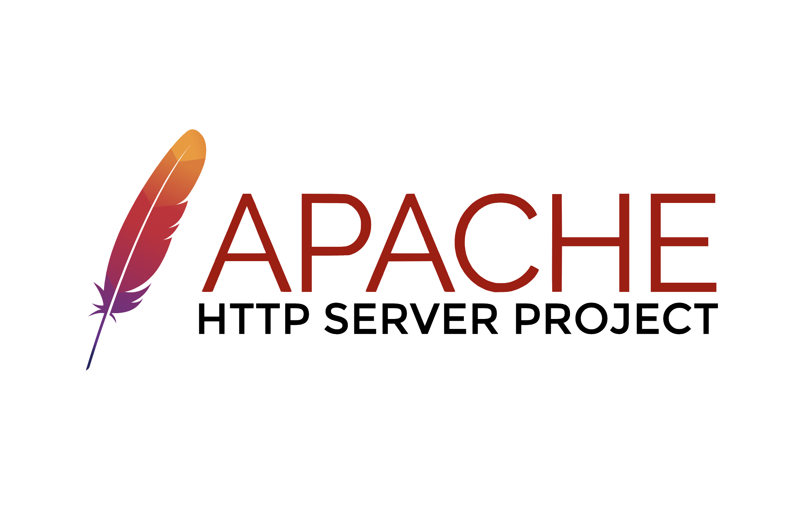
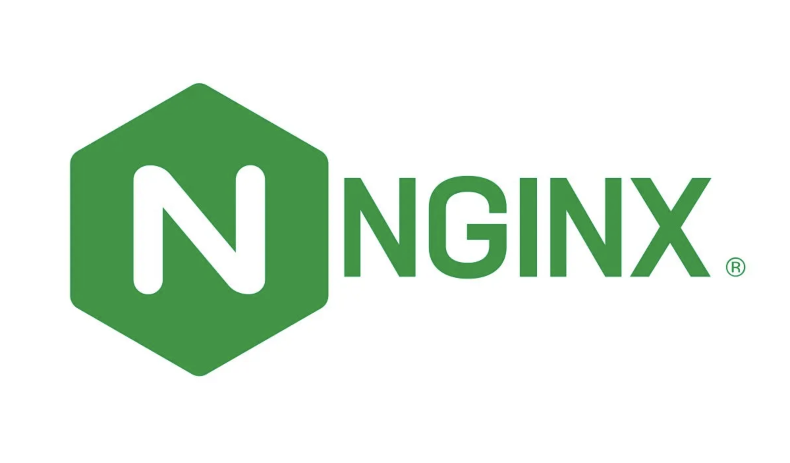
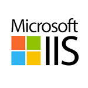

# Deliverable 1 Submission

## Basic Terminology

### What is a web server? Hardware and software side
A web server may either refer to hardware or software, or both of them working together.
- In terms of hardware, a web server is a computer storing web server software and a website's files, connecting to the Internet and facilitating data exchange with other connected devices.
- On the other hand, software, a web server includes components, such as a HTTP server, which interprets URLs and the HTTP protocol. Accessible via domain names, it delivers hosted website content to end user's devices. 

### What are some different web server applications?
#### Apache HTTP server

Apache HTTP server (also known as Apache) is a free, open-source web server. Apache is a part of the LAMP stack, a software stack that powers around 40% of all websites on the Internet.

#### Nginx

Nginx is an open-source web server that can also act as a reverse proxy, email proxy, and a load balancer. Nginx is event-driven, highly scalable, and can process multiple requests at the same time.

#### IIS

Microsoft IIS (Internet Information Services) is a free web server software package for Windows Server. IIS only runs on Windows operating systems.

### What is virtualization?

### What is virtualbox?

### What is a virtual machine?

### What is Ubuntu Server?

### What is a firewall?

### What is SSH?

## Important Concepts To Understand
- __Virtual Hosts:__
- __DocumentRoot:__