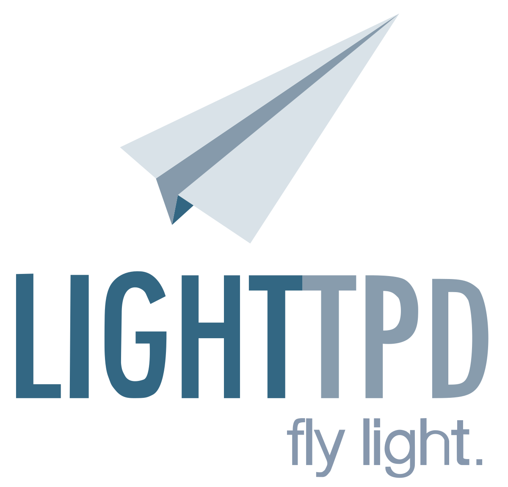

# Deliverable 1 Submission

## Basic Terminology

### What is a web server? Hardware and software side
A web server may either refer to hardware or software, or both of them working together.
- In terms of hardware, a web server is a computer storing web server software and a website's files, connecting to the Internet and facilitating data exchange with other connected devices.
- On the other hand, software, a web server includes components, such as a HTTP server, which interprets URLs and the HTTP protocol. Accessible via domain names, it delivers hosted website content to end user's devices. 

### What are some different web server applications?
#### Apache HTTP server
 
Apache HTTP server (also known as Apache) is a free, open-source web server. Apache is a part of the LAMP stack, a software stack that powers around 40% of all websites on the Internet. It includes tons of functionalities through a large collection of modules, available on all platforms, and easy scripting through Lua.

#### Nginx
 
Nginx is an open-source web server that can also act as a reverse proxy, email proxy, and a load balancer. Nginx is event-driven, highly scalable, and can process multiple requests at the same time.

#### Lighthttpd
 
Lighthttpd is a capable, single-threaded web server that can easily handle a few hundred requests per second and still go easy on system resources. It was designed to overcome resource usage challenges in low-memory and low-CPU environments.

### What is virtualization?
Virtualization is defined as creating virtual versions of something. It is often used to let multiple OSs (Operating Systems) run on one physical machine at the same time. 

### What is virtualbox?
VirtualBox is a powerful virtualization product for enterprise as well as home use. It is extremely feature rich and high performance, it is also freely available as Open Source Software under the terms of the GNU General Public License (GPL) version 3.

### What is a virtual machine?
A virtual machine is a software that emulates an entire computer, with the help of a hypervisor.

### What is Ubuntu Server?
Ubuntu server is a version of the Ubuntu operating system designed and engineered as a backbone for the Internet. It is widely used for hosting and managing various server workloads due to its stability, security, and extensive software ecosystem.

### What is a firewall?
A firewall is a network security device that monitors traffic to or from your network. It allows or blocks traffic based on a defined set of security rules. It can be either hardware or software-based.

### What is SSH?
SSH, also known as Secure Shell, is a network protocol that gives users a secure way to access a computer over an unsecured network. It provides strong password authentication and public key authentication, as well as encrypted data communications between two computers connecting over an open network, such as the Internet.

## Important Concepts To Understand
- __Virtual Hosts:__ Virtual hosting is a method for hosting multiple domain names on a single server. Which allows one server to share its resources, such as memory and processor cycles, without requiring all services provided to use the same host name.
- __DocumentRoot:__ Document root is simply the directory on a web server where the website files for a domain name are stored.
- __UFW:__ UFW, which stands for Uncomplicated Firewall, is a user-friendly frontend for managing iptables, a software-based firewall solution. It simplifies the process of configuring the firewall on a linux system.
- __LAMP Stack:__ LAMP Stack is an acronym for Linux, Apache, MySQL, and PHP/Python/Perl, representing a common software stack used for hosting dynamic websites. 