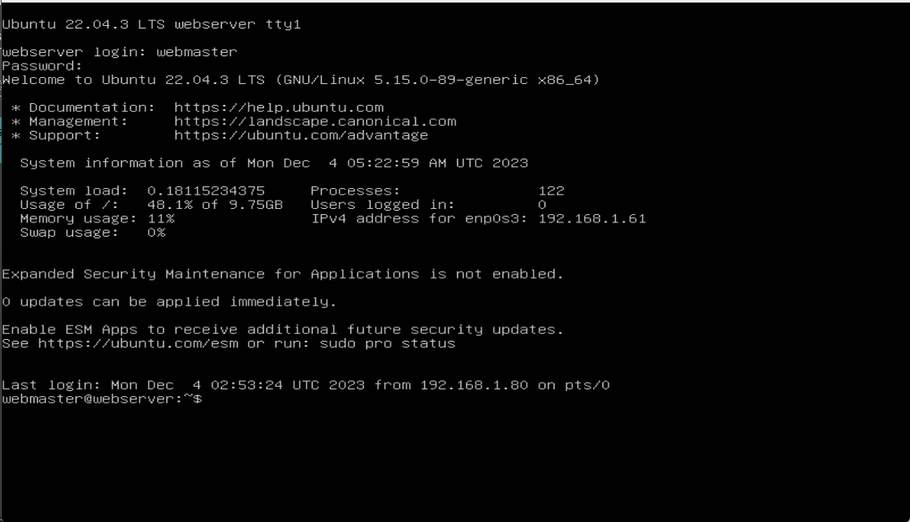

# Deliverable 2 Submission

## What are the server hardware specifications (virtual machine settings)? Take a screenshot - don’t type it!

## What is Ubuntu server log in screen? Take screenshot - do not type it!

## What is the IP address of your Ubuntu Server Virtual Machine?
192.168.1.61

## How do you enable the Ubuntu Firewall?
sudo ufw enable

## How do you check if the Ubuntu Firewall is running?
sudo ufw status

## How do you disable the Ubuntu Firewall?
sudo ufw disable

## How do you add Apache to the Firewall?
sudo ufw allow 'Apache'

## What is the command you used to install Apache?
sudo apt install apache2

## What is the command you use to check if Apache is running?
systemctl status apache2 --no-pager

## What is the command you use to stop Apache?
sudo systemctl stop apache2

## What is the command you use to restart Apache?
sudo systemctl restart apache2

## What is the command used to test Apache configuration?
sudo apache2ctl configtest

## What is the command used to check the installed version of Apache?
apache2 -v

## What are the most common commands to troubleshoot Apache errors? Provide a brief description of each command.
- `systemctl` - Controls and interacts with Linux services via the `systemd` service manager
- `journalctl` - Queries and views the logs that are generated by `systemd`
- `apachectl` - When troubleshooting, this command is used to check Apache's configuration

## Which are Apache Log Files, and what are they used for? Provide examples and screenshots.
The apache log files are located in /var/log/apache2/error.log and they are crucial for troubleshooting. They contain detailed information about errors with timestamps, error modules, error codes, and text descriptions. Below are error log examples:  
`[Wed Jul 15 01:34:12.093005 2020] [proxy:error] [pid 13949:tid 140150453516032] (13)Permission denied: AH00957: HTTP: attempt to connect to 127.0.0.1:9090 (127.0.0.1) failed`

`[Wed Jul 15 01:34:12.093078 2020] [proxy_http:error] [pid 13949:tid 140150453516032] [client 127.0.0.1:42480] AH01114: HTTP: failed to make connection to backend: 127.0.0.1`