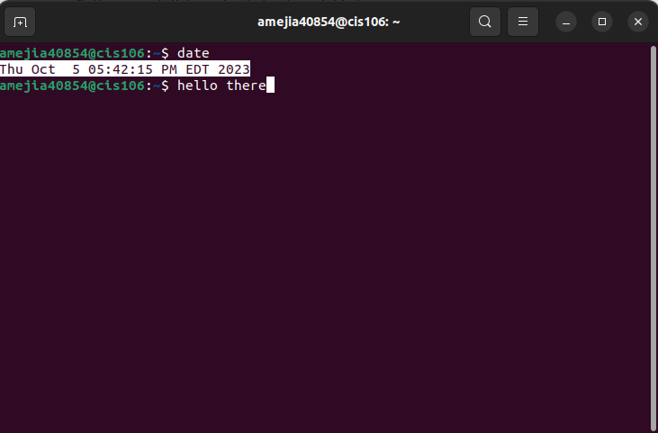
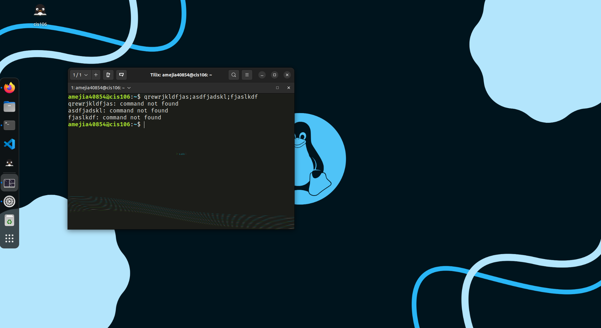
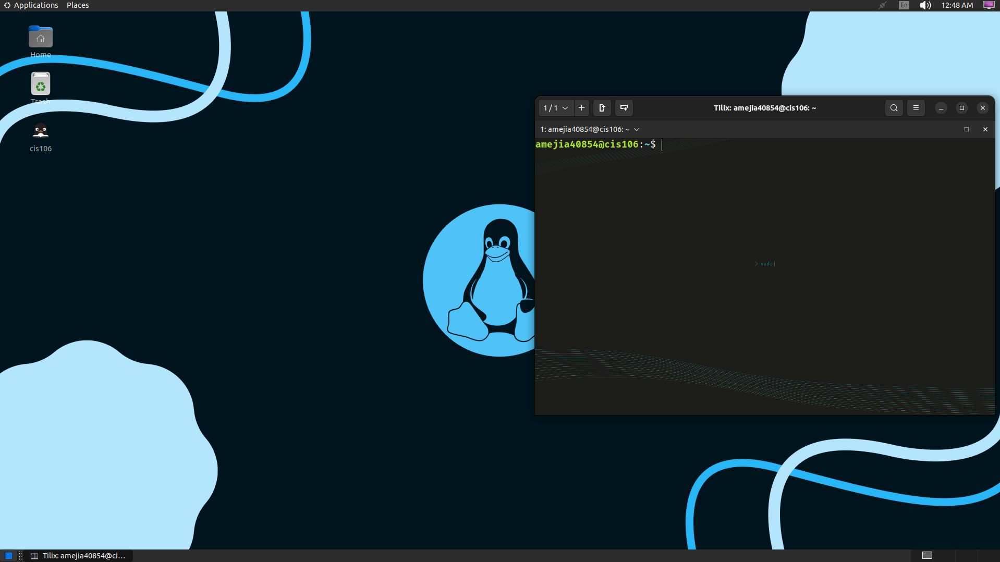

# Lab 3 Using Ubuntu Submission

## Question 1

## Question 2

## Question 3
| Program purpose     | Package Name | Version |
| ------------------- | ------------ | ------- |
| Play a tetris game  | blockattack  | 2.7.0   |
| Play a video file   | dragonplayer | 21.12.3 |
| Browse the internet | falkon       | 3.2.0   |
| Read your email     | claws-mail   | 4.0.0   |
| Play music          | lollypop     | 1.4.33  |

## Question 4
| command | what it does                                                                                                                                 |
| ------- | -------------------------------------------------------------------------------------------------------------------------------------------- |
| echo    | displays a line of text (string) to the output.                                                                                              |
| fortune | displays a random epigram which could be offensive or not.                                                                                   |
| cowsay  | ASCII picture of a cow saying whatever user provided.                                                                                        |
| lolcat  | gradient rainbow coloring effect for the output                                                                                              |
| figlet  | converts text to large characters made up of ordinary screen characters                                                                      |
| toilet  | displays large colorful characters, similar to figlet                                                                                        |
| rig     | Random Identity Generator, pieces together a random first name, last name, street address, and accurate city, state, zip code, and area code |