# Lab 8 Using VIM

## Question 1

### Practice 1
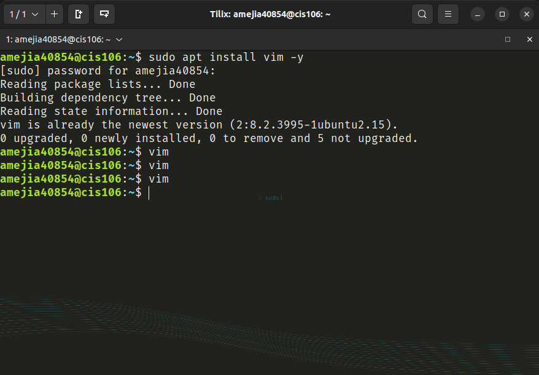
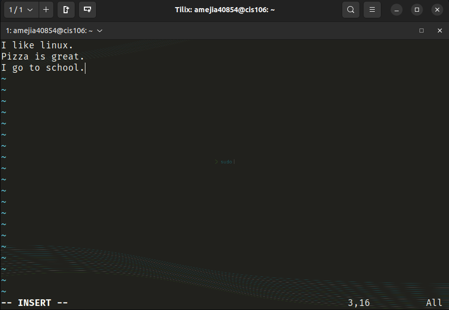

### Practice 2
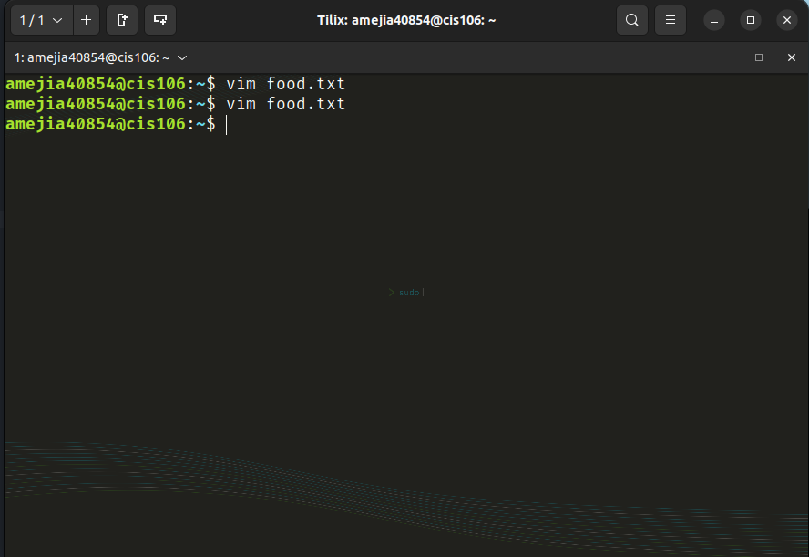
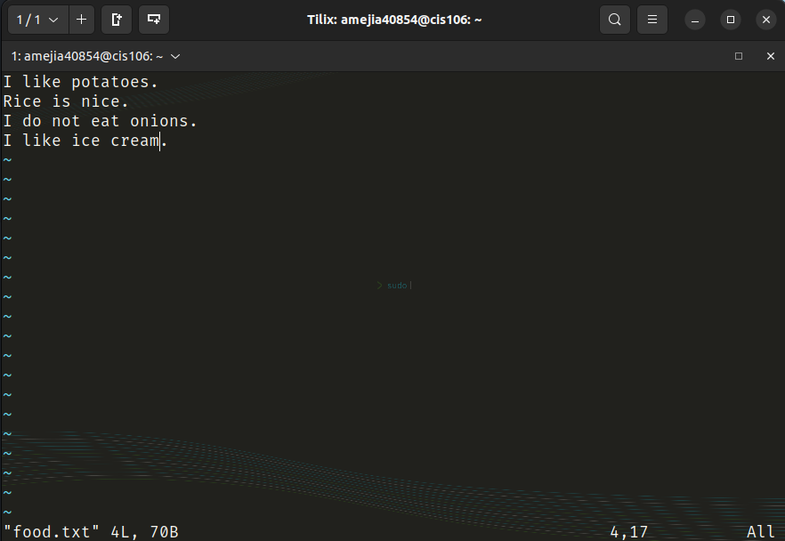

### Practice 3
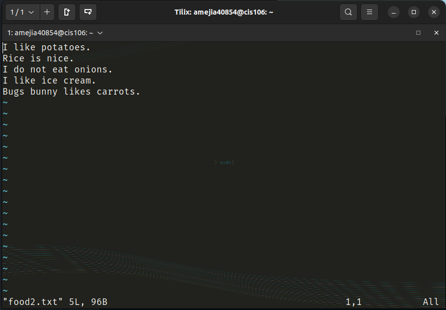
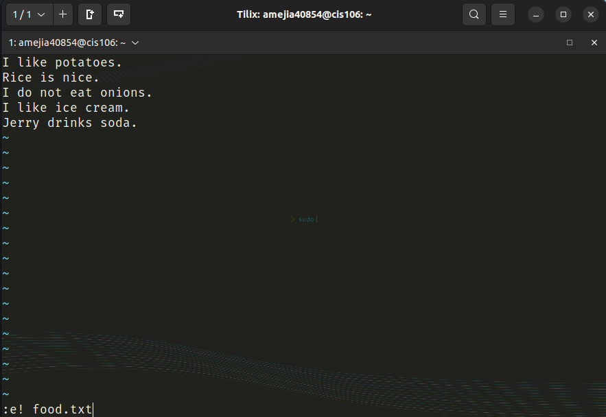
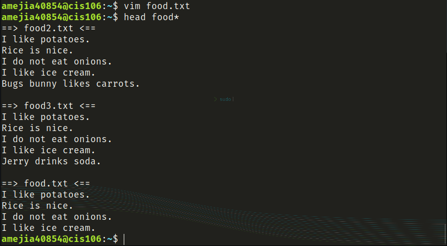

### Practice 4
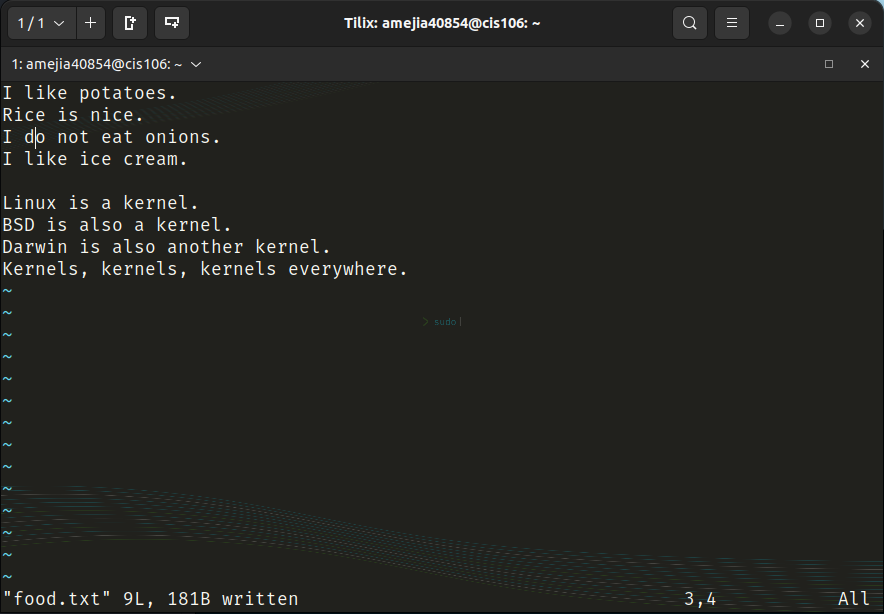

## Question 2

### Linux markdown
[linux.md](linux.md)
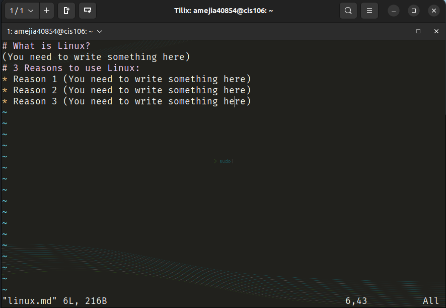

### Linux+other markdown
[linux+other.md](linux+other.md)
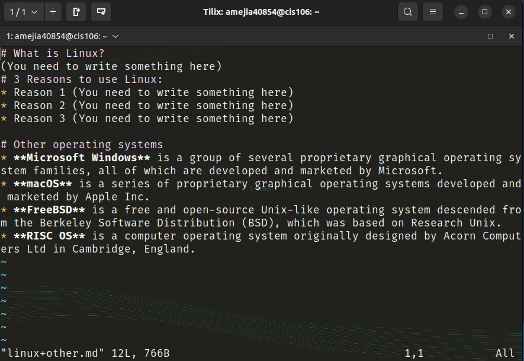

### GNU+Linux markdown
[GNU+Linux.md](GNU+Linux.md)
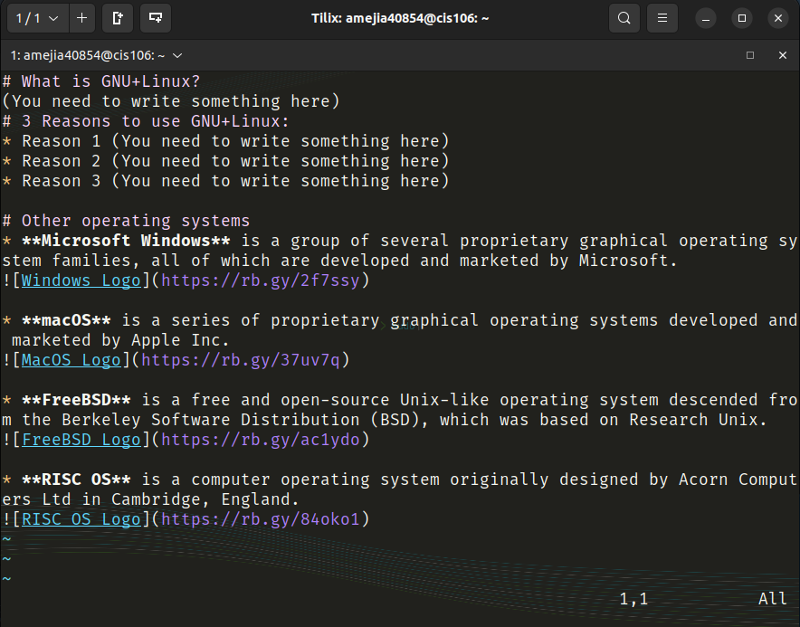