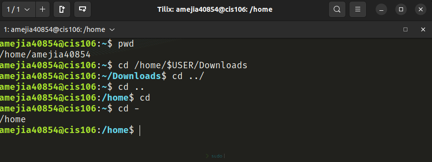
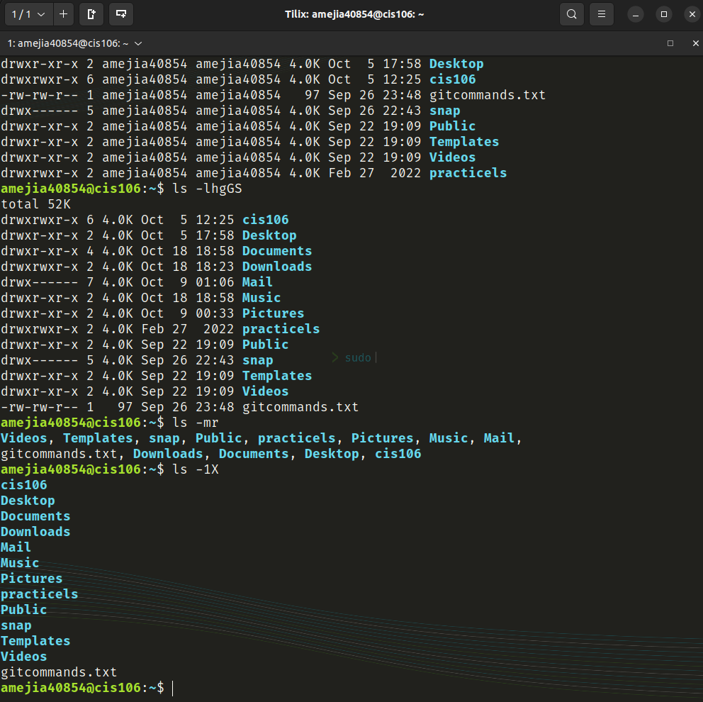
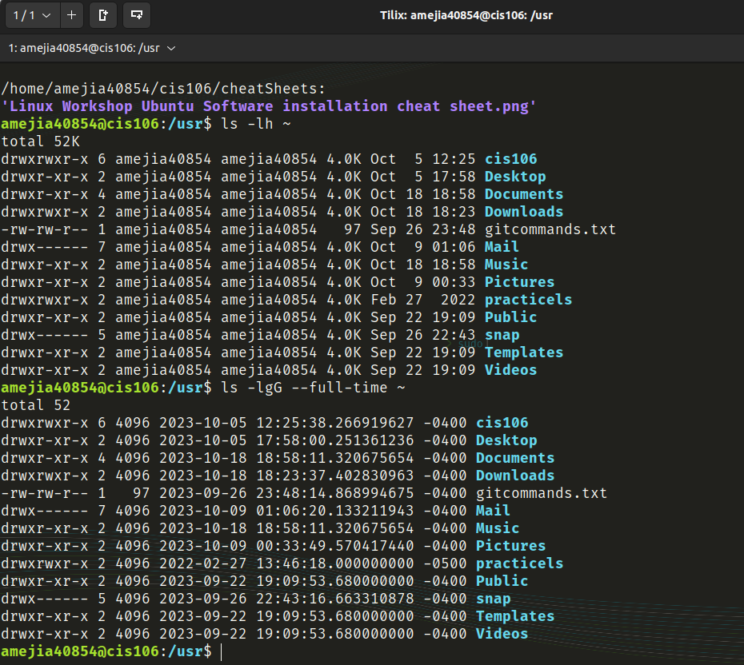
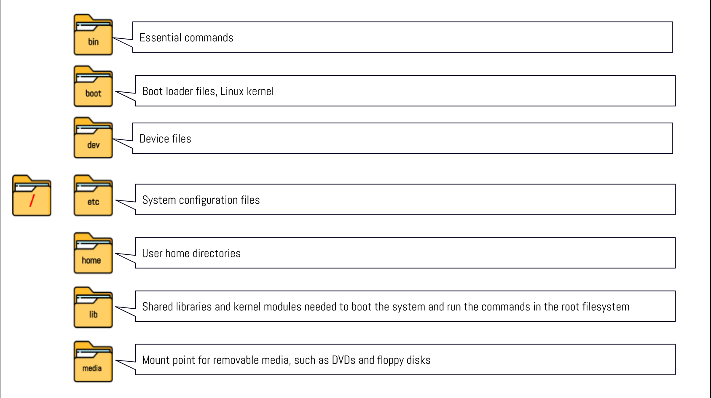
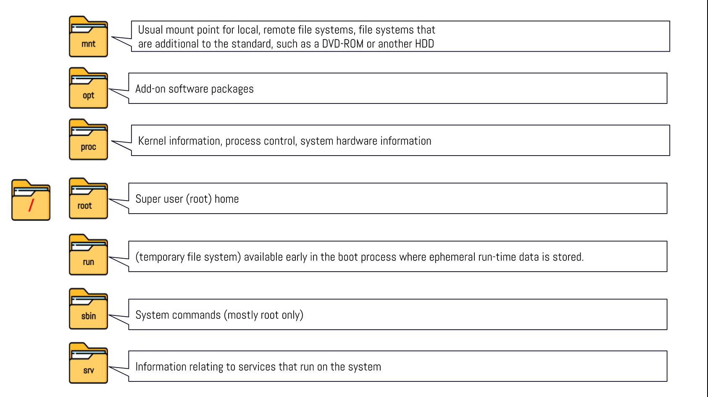
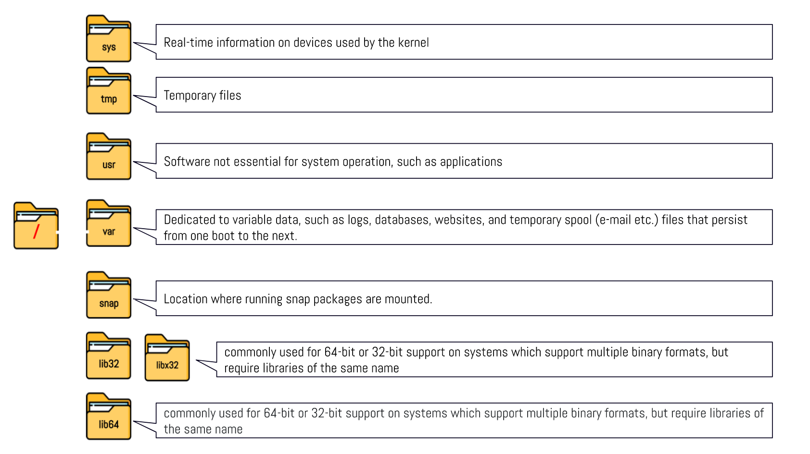

# Week Report 4

## Practice 1

## Practice 2

## Challenge Practice

## Linux file system directories and their purpose

## Navigating the file system
| Command | What it does                                | Syntax                        | Example            |
| ------- | ------------------------------------------- | ----------------------------- | ------------------ |
| pwd     | displays the current working directory      | `pwd`                         | `pwd`              |
| cd      | changes the current working directory       | `cd` + `destination`          | `cd ~/Downloads`   |
| ls      | displays all the files in a given directory | `ls` + `option` + `directory` | `ls -a ~/Pictures` |

## Basic terminology
- __File system__
  - The way files are stored and organized
- __Current directory__
  - The directory you are currently in at the moment
- __Parent directory__
  - The previous directory of your current directory
- __Your Home vs The home directory__
  - The home directory displays all the users utilizing the computer
  - Your home directory displays all your own user files
- __Pathname__
  - Indicates the location of the file in the file system
- __Absolute path__
  - The file location starting at the root of the file system
- __Relative path__
  - The file location starting at the current working directory