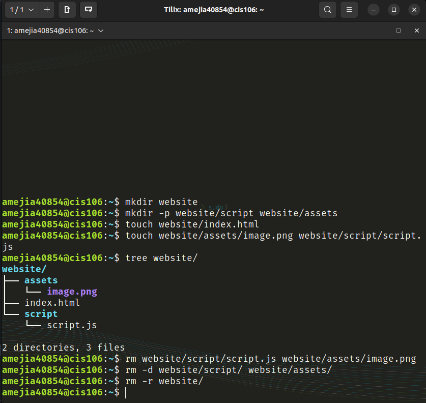
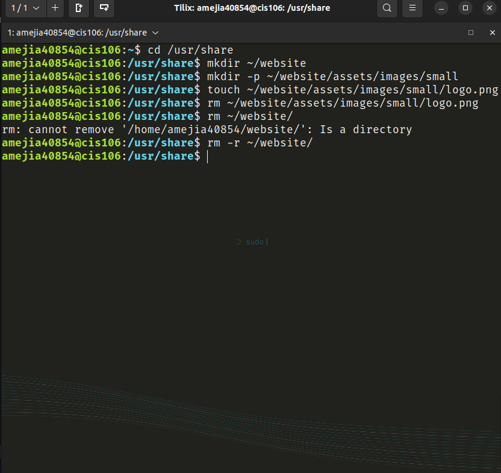
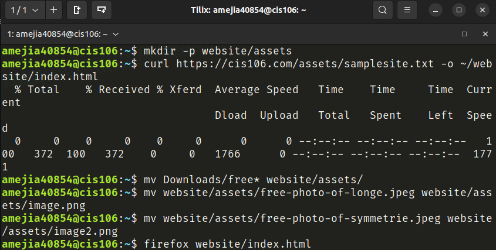
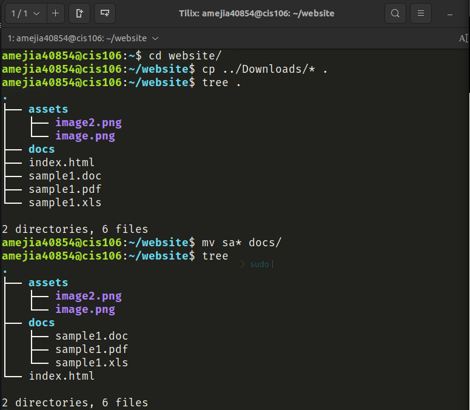

# Week Report 4

## Question Responses:

- __What are Command Options?__
Command Options modify or enhance the command's behavior

- __What are Command Arguments?__
Command Arguments are items the commands act on which can be a file or directory

- __Which command is used for creating directories? Provide at least 3 examples.__
The command used to make directories is mkdir.
- Example 1:
  - Create a directory in current working directory: `mkdir newDir`
- Example 2:
  - Create a new directory with spaces in it: `mkdir Pictures/'Anime Pictures'`
- Example 3:
  - Create multiple directories: `mkdir newDir NewDir2`

- __What does the touch command do? Provide at least 3 examples.__
The touch command creates files.
- Example 1:
  - Create a file: `touch index.html`
- Example 2:
  - Create multiple files: `touch index.html css/style.css`
- Example 3:
  - Create a file with spaces: `touch assets/"Restaurant Background.jpg"`

- __How do you remove a file? Provide an example.__
The command used to remove a file is rm
- Example:
  - Remove a file: `rm leagueOfLegends.exe`

- __How do you remove a directory and can you remove non-empty directories in Linux? Provide an example__
To remove a directory: mkdir or rm -d.
- Example:
  - Remove an empty directory: `rm -d ~/Documents/images/`
To remove a non-empty directory: rm -r
- Example:
  - Remove a non-empty directory: `rm -r ~/Documents/Games`

- __Explain the mv and cp command. Provide at least 2 examples of each__
The mv command can move and rename directories
- Example 1:
  - Move a directory: `mv ~/Downloads/files ~/Documents/files`
- Example 2:
  - Rename a directory: `mv ~/Documents/files ~/Documents/confidential`
  
The cp command can copy files/directories from a source to a destination
- Example 1:
  - Copy a file: `cp Downloads/wallpapers.zip Pictures/`
- Example 2:
  - Copy multiple files: `cp Downloads/picture1.png Downloads/picture2.png Pictures/`

## Practice 1

## Practice 2

## Practice 3

## Practice 4
