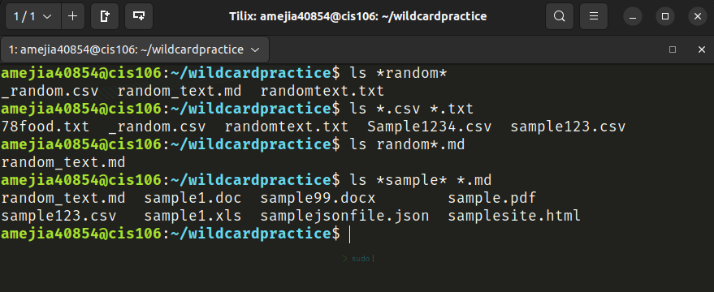
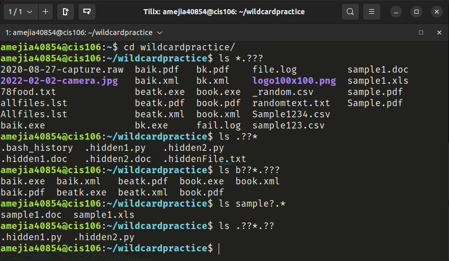
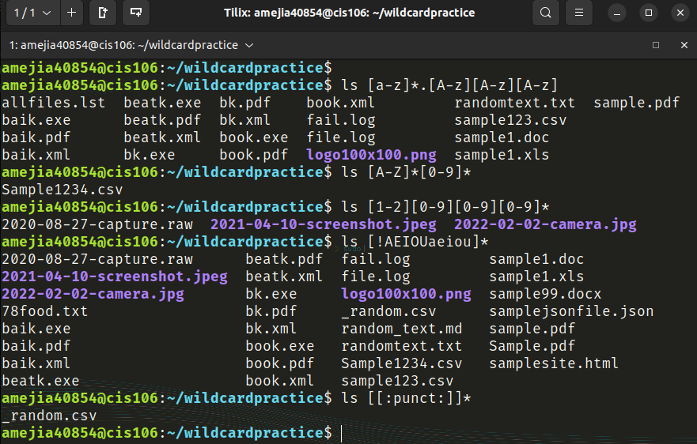

# Week Report 6

## Wildcards:

### * Wildcard
The main wildcard is a star or asterisk and it matches anything from 0 to any number of characters
- Example 1:
  - list all the files ending in txt: `ls *.txt`
- Example 2:
  - move files ending in txt: `mv *.txt /Documents/Docs`
- Example 3:
  - copy files containing new and old: `cp *new* *old* /Documents/folder/`

### ? Wildcard
The question mark wildcard matches precisely one character
- Example 1:
  - list all files that have two characters between letter b and k: `ls b??k*`
- Example 2:
  - List all files that contain single character between letter f and l: `ls f?l*`
- Example 3:
  - list all files with 3 letter file extension: `ls *.???`

### [] Wildcard
The brackets wildcard matches a single character in a range
- Example 1:
  - list files with a vowel after letter f: `ls f[aeiou]*`
- Example 2:
  - list all files that contain at least two numbers: `ls *[0-9][0-9]*`
- Example 3:
  - list all files that don't contain a number: `ls *[!0-9]*`

## Practices:

### Practice 5

### Practice 5

### Practice 5

## Brace Expansion
Brace expansion {} allows you to generate arbitrary strings to use with commands
- Example 1:
  - Create a whole directory structure in a single command: `mkdir -p music/{jazz,rock}/{mp3files,videos,oggfiles}`
- Example 2:
  - Create an N number of files to use: `touch site{1..5}.html`
- Example 3:
  - Remove multiple files in a directory: `rm -r {dir1,dir2,dir3,file.txt,image.png}`